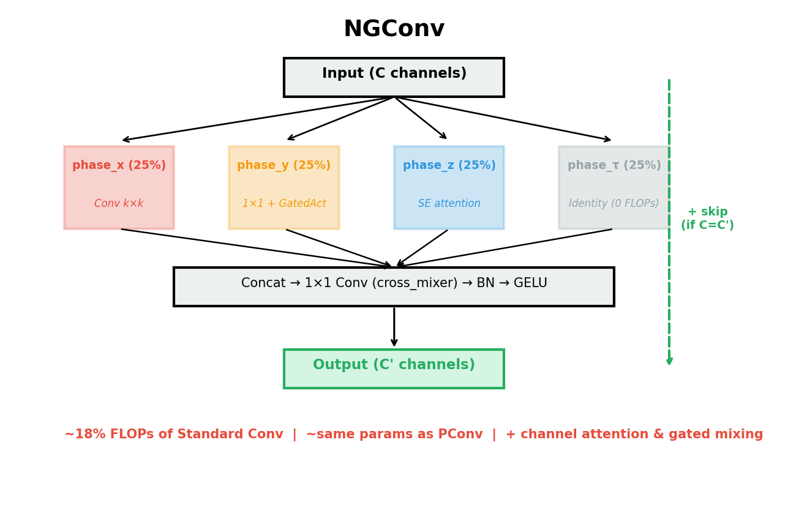
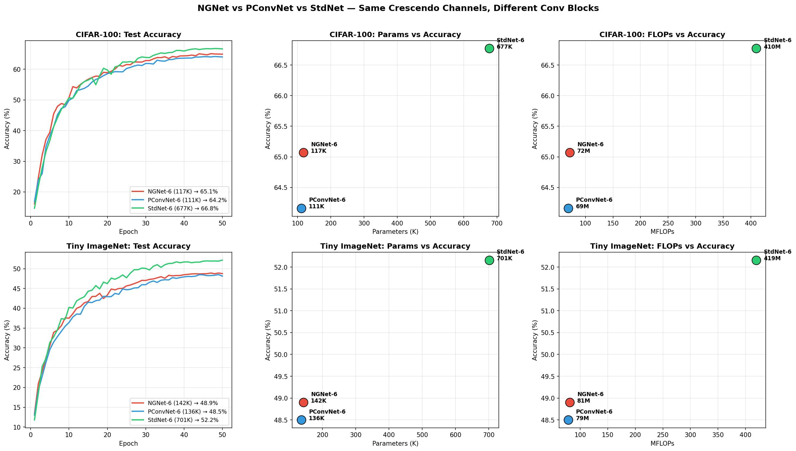
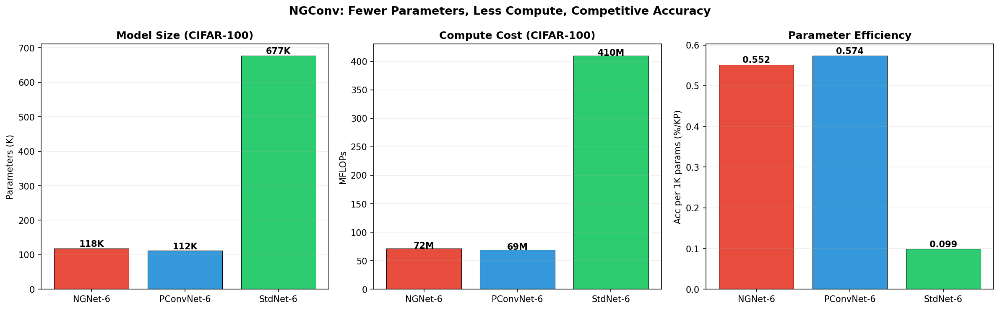
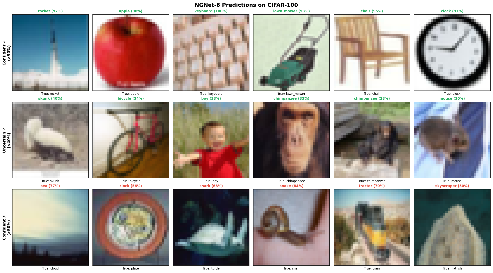

# NGNet: Minimal-Parameter CNN with NGConv

**121K parameters. 65% on CIFAR-100. ~18% FLOPs of Standard Conv.**

NGConv (Neural Gated Convolution) splits input channels into 4 specialized phases — applying expensive spatial convolution to only 25% of channels while maintaining full learning capacity through lightweight channel mixing and attention.



## Results

Comparison of 3 conv blocks with **identical crescendo channel structure** (`64→96→48→120→64→120→200`), trained for 50 epochs each:

### CIFAR-100

| Model | Params | MFLOPs | Accuracy | Acc/KP |
|---|---:|---:|---:|---:|
| **NGNet-6** | **118K** | **72** | **65.07%** | **0.552** |
| PConvNet-6 | 112K | 69 | 64.16% | 0.574 |
| StdNet-6 | 677K | 410 | 66.77% | 0.099 |

### Tiny ImageNet (64×64, 200 classes)

| Model | Params | MFLOPs | Accuracy | Acc/KP |
|---|---:|---:|---:|---:|
| **NGNet-6** | **143K** | **81** | **48.90%** | **0.343** |
| PConvNet-6 | 136K | 79 | 48.50% | 0.355 |
| StdNet-6 | 702K | 420 | 52.16% | 0.074 |

> **NGConv beats PConv on both datasets** with only ~5% more parameters, thanks to the additional channel mixing (phase_y) and channel attention (phase_z).
>
> NGNet achieves **97.5% of StdNet accuracy with 5.7× fewer parameters and 5.7× fewer FLOPs**.




## How NGConv Works

```
Input (C channels) → split into 4 × 25%
  ├─ phase_x: Conv2d k×k        — spatial features (only heavy op)
  ├─ phase_y: 1×1 Conv + GatedAct — channel mixing (light)
  ├─ phase_z: GAP → FC → FC     — channel attention / SE-style (minimal)
  └─ phase_τ: identity           — zero FLOPs, zero params
→ Concatenate → 1×1 Conv (cross_mixer) → BN → GELU → Output
```

**Key insight**: FLOPs scale with spatial conv size, but learning capacity scales with total parameters. NGConv decouples these — heavy spatial conv on 25% of channels, cheap-but-learnable ops on the rest, and a 1×1 cross_mixer that lets everything interact.

### vs Standard Conv
- **~18% FLOPs** per layer (only 25% of channels undergo k×k conv)
- **~17% parameters** (no full-channel spatial conv)
- 1×1 cross_mixer preserves channel interaction

### vs PConv (FasterNet)
- **+5% parameters** (phase_y and phase_z add learnable ops)
- **+5% FLOPs** (channel mixing and attention are cheap)
- **Better accuracy** — PConv passes through 75% unchanged; NGConv actively processes them

## Crescendo Channel Pattern

```
64 → 96 → 48 → 120 → 64 → 120 → 200
     ↑     ↓      ↑     ↓      ↑
   expand squeeze expand squeeze expand
```

Each compression-expansion cycle is stronger than the previous, forcing increasingly abstract feature representations. This pattern works especially well with NGConv because the 1×1 cross_mixer handles channel transitions efficiently.

## Quick Start

```python
from ngconv import NGConv
from ngnet import NGNet6

# Use NGConv as a drop-in conv block
block = NGConv(in_ch=64, out_ch=128, k=3)

# Use the full NGNet-6 model
model = NGNet6(num_classes=100, img_size=32)   # CIFAR-100
model = NGNet6(num_classes=200, img_size=64)   # Tiny ImageNet
```

### Training

```bash
# CIFAR-100
python train.py --dataset cifar100 --epochs 50

# CIFAR-10
python train.py --dataset cifar10 --epochs 50

# Tiny ImageNet (download dataset first)
python train.py --dataset tiny-imagenet --epochs 50 --data-dir ./tiny-imagenet-200
```

## Files

```
ngconv.py    — NGConv block (standalone, no dependencies beyond PyTorch)
ngnet.py     — NGNet-6 crescendo architecture
train.py     — Training script for CIFAR-10/100 and Tiny ImageNet
```

## Sample Predictions



## Kaggle Notebook

Full experiment with training logs, visualizations, and comparisons:

**[NGNet: Minimal-Parameter CNN](https://www.kaggle.com/code/nyoriworks/ngnet-minimal-param-cnn)**

## License

Apache-2.0 license

## Citation

```
@misc{ngnet2026,
  author = {nyoriworks},
  title  = {NGNet: Minimal-Parameter CNN with Neural Gated Convolution},
  year   = {2026},
  url    = {https://github.com/nyoriworks/ngnet-minimal-param-cnn}
}
```
